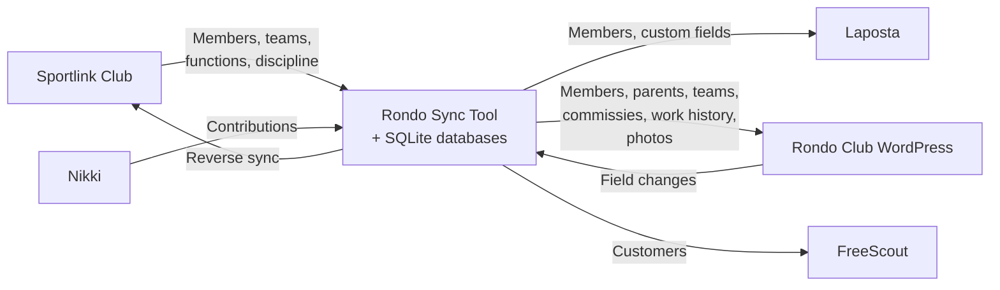

# Rondo Sync

Sportlink Club is the member administration system used by Dutch sports clubs, mandated by the KNVB (Royal Dutch Football Association). It is the single source of truth for member data, but it lacks APIs. This tool extracts member data via browser automation (Playwright with headless Chromium and TOTP 2FA) and syncs it to Laposta (email marketing), Rondo Club (WordPress), FreeScout (helpdesk), and more. It also pulls contribution data from Nikki, a separate financial system.

Hash-based change detection ensures only actual changes are synced. Club volunteers never have to enter the same data twice.

## System Architecture



## Sync Pipelines

| Pipeline | Schedule | What it syncs |
|----------|----------|---------------|
| People | 4x daily | Members, parents, photos → Laposta + Rondo Club |
| Functions | 4x daily + weekly full | Commissies, free fields, work history → Rondo Club |
| Nikki | Daily | Financial contributions → Rondo Club |
| FreeScout | Daily | Members → FreeScout helpdesk customers |
| Teams | Weekly | Team rosters + work history → Rondo Club |
| Discipline | Weekly | Discipline cases → Rondo Club |

## Daily Timeline

All times are Europe/Amsterdam timezone.

```
 07:00         Nikki sync
 07:30         Functions sync (recent) → 08:00 People sync (1st) + FreeScout sync
 10:30         Functions sync (recent) → 11:00 People sync (2nd)
 13:30         Functions sync (recent) → 14:00 People sync (3rd)
 16:30         Functions sync (recent) → 17:00 People sync (4th)

 Sunday  01:00  Functions sync (full --all)
 Sunday  06:00  Teams sync
 Monday  23:30  Discipline sync
```

## Key Features

- **Browser automation** — Playwright (headless Chromium) for systems without APIs, with TOTP 2FA
- **Change detection** — SHA-256 hash-based diffing, only syncs records that actually changed
- **State tracking** — 4 SQLite databases maintain ID mappings and sync history
- **Locking** — flock-based concurrency prevention per pipeline
- **Email reports** — HTML summaries after every sync via Postmark
- **Photo sync** — downloads member photos and uploads to WordPress with state machine
- **Reverse sync** — can push Rondo Club changes back to Sportlink (currently disabled)

## Quick Start

```bash
npm install
npx playwright install chromium
cp .env.example .env  # Edit with your credentials
```

```bash
scripts/sync.sh people           # Members, parents, photos
scripts/sync.sh functions        # Commissies + free fields (recent)
scripts/sync.sh functions --all  # Full commissie sync (all members)
scripts/sync.sh nikki            # Nikki contributions
scripts/sync.sh freescout        # FreeScout customers
scripts/sync.sh teams            # Team rosters
scripts/sync.sh discipline       # Discipline cases
scripts/sync.sh all              # Everything
```

See [Installation Guide](docs/installation.md) for full setup instructions.

## Documentation

| Document | Contents |
|----------|----------|
| [Installation](docs/installation.md) | Prerequisites, server setup, initial sync, cron |
| [Architecture](docs/sync-architecture.md) | System overview, schedules, field mappings, data flow |
| [People Pipeline](docs/pipeline-people.md) | 7-step flow, Laposta + Rondo Club field mappings |
| [Nikki Pipeline](docs/pipeline-nikki.md) | Contribution download + Rondo Club sync |
| [Teams Pipeline](docs/pipeline-teams.md) | Team download + work history |
| [Functions Pipeline](docs/pipeline-functions.md) | Commissies, free fields, daily vs full mode |
| [FreeScout Pipeline](docs/pipeline-freescout.md) | Customer sync with custom fields |
| [Discipline Pipeline](docs/pipeline-discipline.md) | Discipline cases + season taxonomy |
| [Reverse Sync](docs/reverse-sync.md) | Rondo Club → Sportlink (currently disabled) |
| [Database Schema](docs/database-schema.md) | All 4 databases, 21 tables |
| [Operations](docs/operations.md) | Server ops, monitoring, deploys |
| [Troubleshooting](docs/troubleshooting.md) | Common issues and solutions |
| [Utility Scripts](docs/utility-scripts.md) | Cleanup, validation, inspection tools |

## Tech Stack

Node.js 18+ · Playwright · better-sqlite3 · otplib · Postmark · dotenv

## License

Private project — all rights reserved.
