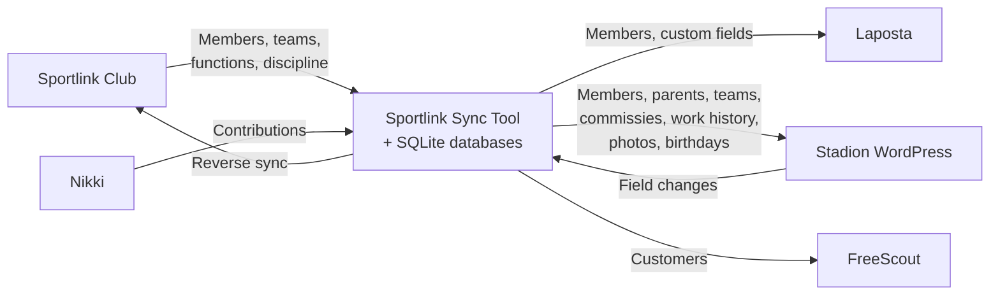
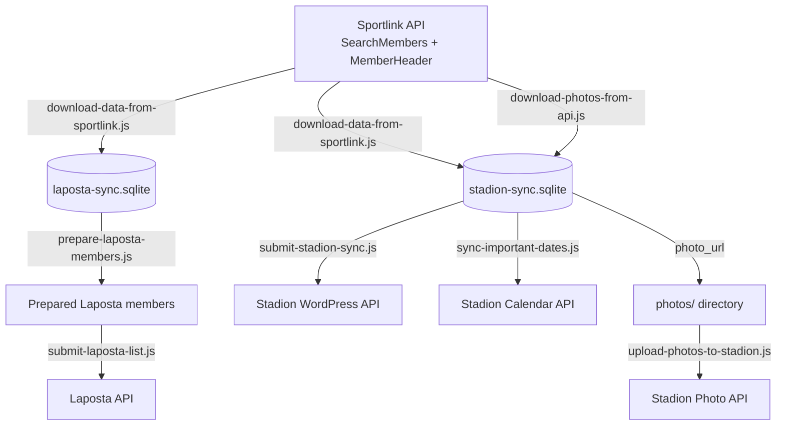
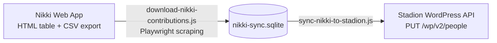
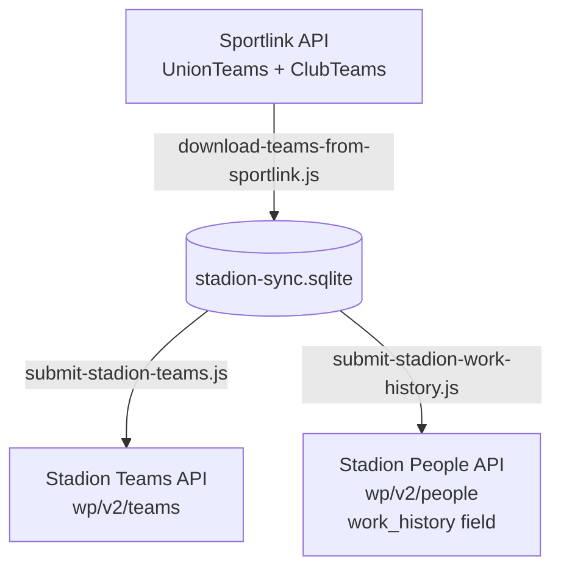
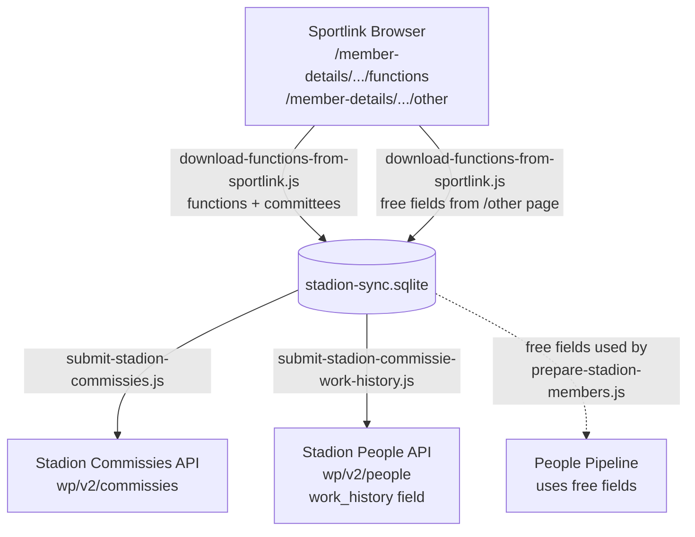
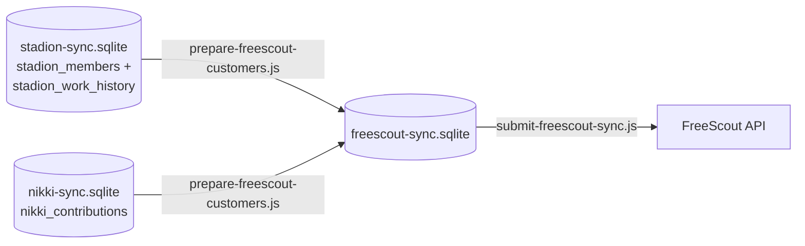
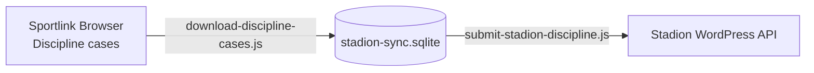
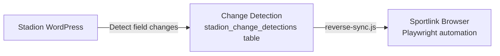

# Sync Architecture

This document describes what data flows from where to where, which fields are synced, on what schedule, and how change detection works.

## Table of Contents

- [System Overview](#system-overview)
- [Schedules](#schedules)
- [API Load Management](#api-load-management)
- [Pipeline 1: People](#pipeline-1-people)
- [Pipeline 2: Nikki](#pipeline-2-nikki)
- [Pipeline 3: Teams](#pipeline-3-teams)
- [Pipeline 4: Functions (Commissies)](#pipeline-4-functions-commissies)
- [Pipeline 5: FreeScout](#pipeline-5-freescout)
- [Pipeline 6: Discipline](#pipeline-6-discipline)
- [Reverse Sync (Stadion to Sportlink)](#reverse-sync-stadion-to-sportlink)
- [Databases](#databases)
- [Locking](#locking)

## System Overview



## Schedules

All times are **Europe/Amsterdam** timezone.

| Pipeline | Schedule | Cron | Notes |
|----------|----------|------|-------|
| People | 4x daily | `0 8,11,14,17 * * *` | Members, parents, birthdays, photos |
| Nikki | Daily | `0 7 * * *` | Contributions to Stadion |
| Functions (recent) | Daily | `15 7 * * *` | Members updated in last 2 days + VOG-filtered volunteers |
| Functions (full) | Weekly Sunday | `0 1 * * 0` | All members with `--all` |
| FreeScout | Daily | `0 8 * * *` | Stadion members to FreeScout customers |
| Teams | Weekly Sunday | `0 6 * * 0` | Team creation + work history |
| Discipline | Weekly Monday | `30 23 * * 1` | Discipline cases |
| Reverse Sync | Hourly | `0 * * * *` | Stadion changes back to Sportlink (**currently disabled**) |

### Daily Timeline

```
 Every hour    Reverse sync (Stadion -> Sportlink) [currently disabled]
 07:00         Nikki sync
 07:15         Functions sync (recent only)
 08:00         People sync (1st) + FreeScout sync
 11:00         People sync (2nd)
 14:00         People sync (3rd)
 17:00         People sync (4th)
```

### Weekly

```
 Sunday  01:00  Functions sync (full --all)
 Sunday  06:00  Teams sync
 Monday  23:30  Discipline sync
```

## API Load Management

Every pipeline is designed to keep data as fresh as possible while minimizing API calls and avoiding overload on external services.

### Selective Sync via Hash-Based Change Detection

All pipelines use **hash-based change detection**. Each record gets a SHA-256 hash of its data (`source_hash`). On sync, the hash is compared to `last_synced_hash`. API calls only happen when hashes differ. This means:

- Local work (reading SQLite, computing hashes) runs every time -- this is cheap
- Expensive work (API calls to Laposta/Stadion/FreeScout) only runs for actual changes
- On a typical run with no changes, zero API calls are made

The Functions pipeline takes this further: the daily run only downloads data for members updated in Sportlink within the last 2 days (plus VOG-filtered volunteers), avoiding the need to scrape all ~1000+ members every day.

### Rate Limiting and Delays

When API calls are needed, all pipelines insert delays between requests to avoid overwhelming external services:

| Target | Delay | Notes |
|--------|-------|-------|
| Laposta API | 2s between requests | Fixed delay via `waitForRateLimit()` |
| Stadion WordPress API | Exponential backoff on errors | 1s, 2s, 4s on retries |
| Stadion photo uploads | 2s between uploads | Both upload and delete operations |
| Nikki to Stadion | 500ms between updates | |
| Photo downloads | 200ms between downloads | 1s exponential backoff on errors |
| FreeScout API | Exponential backoff on errors | 1s, 2s, 4s on 5xx errors |
| Sportlink browser scraping | 500ms-1.5s between members | Random jitter to avoid patterns |
| Reverse sync (Sportlink) | 1-2s between members | Random jitter, exponential backoff on errors |

---

## Pipeline 1: People

Runs 4x daily. Downloads member data from Sportlink, syncs to Laposta (email marketing), Stadion (WordPress), and handles photos and birthdays.



### Sportlink to Laposta: Field Mapping

Source: Sportlink `SearchMembers` API. Destination: Laposta custom fields. Configured in `field-mapping.json`.

| Laposta Field | Sportlink Field | Notes |
|---|---|---|
| *(email)* | `Email` | Primary list email |
| `voornaam` | `FirstName` | |
| `tussenvoegsel` | `Infix` | Dutch name particle (van, de) |
| `achternaam` | `LastName` | |
| `geboortedatum` | `DateOfBirth` | YYYY-MM-DD |
| `team` | `UnionTeams` | Comma-separated |
| `geslacht` | `GenderCode` | Normalized: Male->M, Female->V |
| `leeftijdscategorie` | `AgeClassDescription` | |
| `relatiecode` | `PublicPersonId` | KNVB ID |
| `datumpasfoto` | `PersonImageDate` | |
| `lidsinds` | `MemberSince` | |
| `emailadres2` | `EmailAlternative` | |
| `mobielnummer` | `Mobile` | |
| `mobielnummer2` | `MobileAlternative` | |
| `telefoonnummer` | `Telephone` | |
| `telefoonnummer2` | `TelephoneAlternative` | |
| `straatnaam` | `StreetName` | |
| `huisnummer` | `AddressNumber` | |
| `huisnummertoevoeging` | `AddressNumberAppendix` | |
| `postcode` | `ZipCode` | |
| `plaats` | `City` | |
| `naamouder1` | `NameParent1` | |
| `naamouder2` | `NameParent2` | |
| `emailouder1` | `EmailAddressParent1` | Creates separate parent list entry |
| `emailouder2` | `EmailAddressParent2` | Creates separate parent list entry |
| `telefoonouder1` | `TelephoneParent1` | |
| `telefoonouder2` | `TelephoneParent2` | |
| `oudervan` | *(aggregated)* | Comma-separated child names for parent entries |

Parent emails create separate Laposta list entries (deduplicated across lists).

### Sportlink to Stadion Members: Field Mapping

Source: Sportlink `SearchMembers` API + free fields from SQLite. Destination: Stadion `wp/v2/people` ACF fields.

**Core person fields:**

| Stadion ACF Field | Source | Notes |
|---|---|---|
| `first_name` | `FirstName` | Required on every PUT |
| `last_name` | `Infix` + `LastName` | Combined with space |
| `knvb-id` | `PublicPersonId` | |
| `gender` | `GenderCode` | Normalized: Male->male, Female->female |
| `birth_year` | `DateOfBirth` | Year extracted |

**Contact info** (ACF repeater `contact_info`):

| Contact Type | Source |
|---|---|
| `email` | `Email` |
| `mobile` | `Mobile` |
| `phone` | `Telephone` |

**Address** (ACF repeater `addresses`):

| Address Field | Source |
|---|---|
| `street` | `StreetName` + `AddressNumber` + `AddressNumberAppendix` |
| `postal_code` | `ZipCode` |
| `city` | `City` |
| `country` | Hardcoded "Nederland" |

**Membership metadata:**

| Stadion ACF Field | Source |
|---|---|
| `lid-sinds` | `MemberSince` |
| `leeftijdsgroep` | `AgeClassDescription` |
| `type-lid` | `TypeOfMemberDescription` |
| `datum-foto` | `PersonImageDate` |

**Free fields** (from `sportlink_member_free_fields` table, populated by Functions pipeline):

| Stadion ACF Field | SQLite Column | Origin |
|---|---|---|
| `freescout-id` | `freescout_id` | Sportlink `Remarks3` |
| `datum-vog` | `vog_datum` | Sportlink `Remarks8` |
| `financiele-blokkade` | `has_financial_block` | Sportlink `MemberHeader` |

**Invoice data** (from `sportlink_member_invoice_data` table, optional `--with-invoice`):

| Stadion ACF Field | SQLite Column |
|---|---|
| `factuur-adres` | `invoice_street` + `invoice_house_number` + etc. |
| `factuur-email` | `invoice_email` |
| `factuur-referentie` | `invoice_external_code` |

### Sportlink to Stadion Parents

Parent entries are created as separate Stadion person posts from `NameParent1`/`NameParent2` fields. They are:
- Deduplicated by email address
- Linked to children via ACF `relationships` field (relationship_type 9 = child)
- Given aggregated contact info from all their children

### Sportlink to Stadion Birthdays

Source: `DateOfBirth`. Destination: `wp/v2/important-dates`.

| Stadion Field | Value |
|---|---|
| `acf.date_value` | `DateOfBirth` (YYYY-MM-DD) |
| `acf.related_people` | `[stadion_id]` of the person |
| `acf.is_recurring` | `true` (annual) |
| `acf.date_type` | Birthday term ID |

### Photo Sync

Photos flow in two steps:

1. **Download**: `photo_url` from Sportlink `MemberHeader` API -> saved to `photos/{knvb_id}.{ext}`
2. **Upload**: `POST /wp-json/stadion/v1/people/{stadion_id}/photo` (multipart form-data)

Photo states tracked in `stadion_members.photo_state`: `pending_download` -> `downloaded` -> `synced`. Removed photos go through `pending_delete` -> `no_photo`.

---

## Pipeline 2: Nikki

Runs daily at 7:00 AM. Downloads contribution data from Nikki and writes per-year financial fields to Stadion person posts.



### Nikki to SQLite: Fields Extracted

A single person can have **multiple contribution lines per year** in Nikki (e.g. separate amounts for different family members or contribution types). Each line is stored as a separate row in SQLite, keyed by `(knvb_id, year, nikki_id)`.

| Source | Field | Type | Notes |
|---|---|---|---|
| HTML table | `knvb_id` | string | Member number column |
| HTML table | `year` | integer | Year column |
| HTML table | `nikki_id` | string | Nikki internal ID (unique per contribution line) |
| HTML table | `saldo` | number | Balance, parsed from European format (e.g. "EUR 1.234,56" -> 1234.56) |
| HTML table | `status` | string | Contribution status (e.g. "Betaald") |
| CSV export | `hoofdsom` | number | Total amount, parsed from European format |

### SQLite to Stadion: Field Mapping

When a person has multiple contribution lines for a year, `saldo` and `hoofdsom` are **summed** across all lines for that member+year combination.

For each contribution year, three ACF fields are written per person:

| Stadion ACF Field | Source | Example |
|---|---|---|
| `_nikki_{YEAR}_total` | `hoofdsom` | `_nikki_2025_total`: 1500.00 |
| `_nikki_{YEAR}_saldo` | `saldo` | `_nikki_2025_saldo`: 250.00 |
| `_nikki_{YEAR}_status` | `status` | `_nikki_2025_status`: "Betaald" |

Up to 4 years of history are retained. The PUT request always includes `first_name` and `last_name` (required by Stadion API).

---

## Pipeline 3: Teams

Runs weekly on Sunday at 6:00 AM. Downloads team rosters from Sportlink, creates team posts in Stadion, and links members to teams via work history.



### Sportlink to Stadion Teams: Field Mapping

Source: Sportlink `UnionTeams` / `ClubTeams` API. Destination: `wp/v2/teams`.

| Stadion Field | Sportlink Field | Notes |
|---|---|---|
| `title` | `TeamName` / `Name` | Post title |
| `acf.publicteamid` | `PublicTeamId` | Sportlink team ID |
| `acf.activiteit` | `GameActivityDescription` | Activity type |
| `acf.gender` | `Gender` | Mapped: Mannen->male, Vrouwen->female, Gemengd->skipped |

Fields stored in SQLite but not sent to Stadion: `team_code`, `player_count`, `staff_count`.

### Sportlink to Stadion Work History: Field Mapping

Links members to their teams via the ACF `work_history` repeater on person posts.

| Stadion ACF Field | Source | Notes |
|---|---|---|
| `work_history[].team` | `stadion_teams.stadion_id` | WordPress post ID of the team |
| `work_history[].job_title` | `role_description` from `sportlink_team_members`, or fallback based on `KernelGameActivities` | "Speler" for players, "Staflid" for staff |
| `work_history[].is_current` | Computed | `true` if currently on team |
| `work_history[].start_date` | Computed | Today's date for new assignments, empty for backfill |
| `work_history[].end_date` | Computed | Empty if current, today's date when removed |

When a member is removed from a team, the entry is kept with `is_current: false` and `end_date` set to today.

---

## Pipeline 4: Functions (Commissies)

Runs daily (recent updates) and weekly (full). Scrapes committee/function memberships and free fields from Sportlink via browser automation.



### Daily vs Full Mode

| Mode | Flag | Members Processed | Table Handling |
|---|---|---|---|
| Daily (recent) | *(default)* | Members with `LastUpdate` in last 2 days + VOG-filtered volunteers | Upsert only (preserves existing data) |
| Weekly (full) | `--all` | All tracked members (~1069) | Clear + replace atomically |

### Sportlink to Stadion Commissies: Field Mapping

Source: browser scraping of `/functions` tab. Destination: `wp/v2/commissies`.

| Stadion Field | Source | Notes |
|---|---|---|
| `title` | `CommitteeName` | Post title |
| `status` | Hardcoded `publish` | |

A synthetic "Verenigingsbreed" commissie is created for club-level functions (not tied to a specific committee).

### Sportlink to Stadion Commissie Work History: Field Mapping

Links members to commissies via the ACF `work_history` repeater on person posts.

| Stadion ACF Field | Source | Notes |
|---|---|---|
| `work_history[].team` | `stadion_commissies.stadion_id` | WordPress post ID of the commissie |
| `work_history[].job_title` | `role_name` from `sportlink_member_committees`, or "Lid" as fallback | Role within committee |
| `work_history[].is_current` | `is_active` | Based on `RelationEnd` and `Status` |
| `work_history[].start_date` | `relation_start` | Normalized to YYYY-MM-DD |
| `work_history[].end_date` | `relation_end` | Empty if current |

### Free Fields (scraped during Functions pipeline, used by People pipeline)

Scraped from the member's `/other` page via two Sportlink APIs:

| Sportlink API | Sportlink Field | SQLite Column | Used By |
|---|---|---|---|
| `MemberFreeFields` | `Remarks3.Value` | `freescout_id` | People pipeline -> Stadion `freescout-id` |
| `MemberFreeFields` | `Remarks8.Value` | `vog_datum` | People pipeline -> Stadion `datum-vog` |
| `MemberHeader` | `HasFinancialTransferBlockOwnClub` | `has_financial_block` | People pipeline -> Stadion `financiele-blokkade` |
| `MemberHeader` | `Photo.Url` | `photo_url` | People pipeline -> photo download |
| `MemberHeader` | `Photo.PhotoDate` | `photo_date` | People pipeline -> photo metadata |

---

## Pipeline 5: FreeScout

Runs daily at 8:00 AM. Reads member data from the local Stadion SQLite database and syncs to FreeScout as customers.



### Stadion/Nikki to FreeScout: Field Mapping

**Standard customer fields** (sent to `POST/PUT /api/customers`):

| FreeScout Field | Source | Origin |
|---|---|---|
| `firstName` | `acf.first_name` | stadion_members |
| `lastName` | `acf.last_name` | stadion_members |
| `emails[].value` | `acf.contact_info` (type=email) | stadion_members |
| `phones[].value` | `acf.contact_info` (type=mobile) | stadion_members |

**Custom fields** (sent to `PUT /api/customers/{id}/customer_fields`):

| FreeScout Custom Field | Field ID | Source | Origin |
|---|---|---|---|
| `union_teams` | 1 | All `team_name` values, comma-separated | stadion_work_history |
| `public_person_id` | 4 | `knvb_id` | stadion_members |
| `member_since` | 5 | `acf['lid-sinds']` | stadion_members |
| `nikki_saldo` | 7 | Most recent year's `saldo` | nikki_contributions |
| `nikki_status` | 8 | Most recent year's `status` | nikki_contributions |

Field IDs are configurable via `FREESCOUT_FIELD_*` environment variables.

---

## Pipeline 6: Discipline

Runs weekly on Monday at 11:30 PM. Downloads discipline cases from Sportlink and syncs to Stadion.



Cases are linked to person posts in Stadion using `knvb_id` -> `stadion_id` mapping.

---

## Reverse Sync (Stadion to Sportlink)

> **Status: currently disabled.** Needs to be fixed and re-enabled.

Scheduled hourly. Detects field changes in Stadion and pushes them back to Sportlink via browser automation.



### Fields Synced Back

| Field | Direction |
|---|---|
| `email` | Stadion -> Sportlink |
| `email2` | Stadion -> Sportlink |
| `mobile` | Stadion -> Sportlink |
| `phone` | Stadion -> Sportlink |
| `datum-vog` | Stadion -> Sportlink |
| `freescout-id` | Stadion -> Sportlink |
| `financiele-blokkade` | Stadion -> Sportlink |

Conflict resolution: compares timestamps with 5-second tolerance. Newer timestamp wins; if equal, Sportlink wins by default.

---

## Databases

Four SQLite databases on the server track sync state:

| Database | Purpose | Key Tables |
|---|---|---|
| `laposta-sync.sqlite` | Laposta sync + Sportlink run data | `members`, `laposta_fields`, `sportlink_runs` |
| `stadion-sync.sqlite` | Stadion ID mappings + all Sportlink scraped data | `stadion_members`, `stadion_parents`, `stadion_teams`, `stadion_commissies`, `stadion_work_history`, `stadion_commissie_work_history`, `stadion_important_dates`, `sportlink_member_functions`, `sportlink_member_committees`, `sportlink_member_free_fields`, `sportlink_member_invoice_data`, `sportlink_team_members` |
| `nikki-sync.sqlite` | Nikki contribution data | `nikki_contributions` |
| `freescout-sync.sqlite` | FreeScout customer mappings | `freescout_customers` |

The `stadion_id` mapping (knvb_id -> WordPress post ID) is critical: without it, syncs create duplicate entries instead of updating existing ones. All databases live on the production server only.

---

## Locking

Each sync type uses `flock` via `scripts/sync.sh` to prevent overlapping runs of the same type. Different sync types can run in parallel. Lock files: `.sync-{type}.lock` in the project directory.
